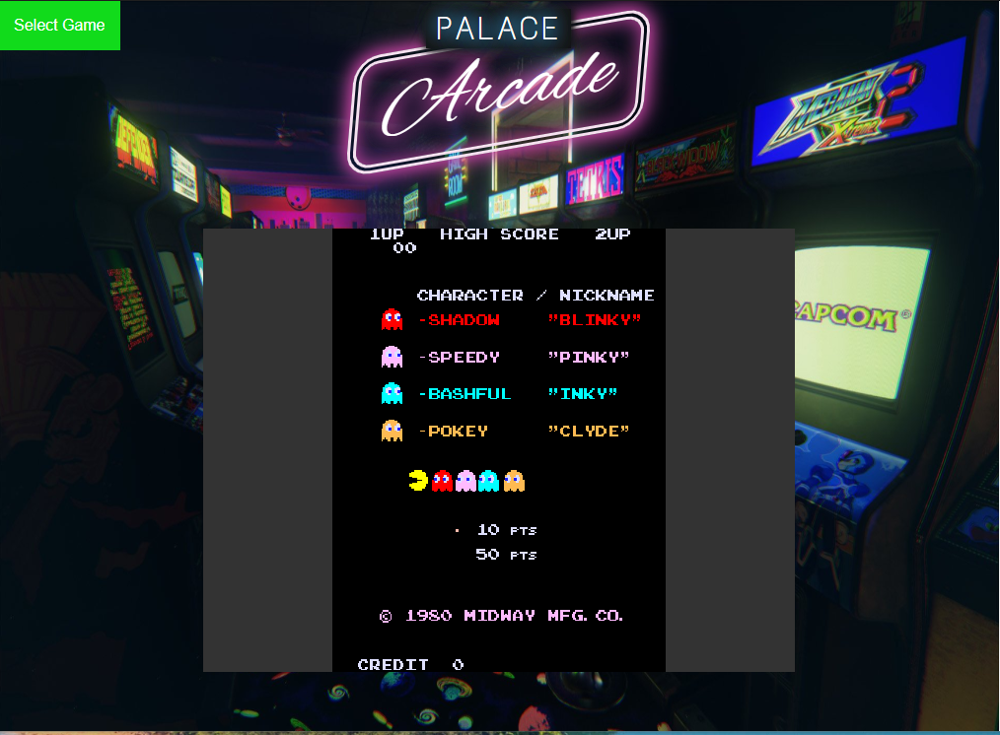

# palace-arcade
A simple demo of Terraform with Azure Container Apps.

Can be used to demonstrate the use of Terraform modules and Sentinel policies (Enterprise).

## Setup
1. Have a TFC organization connected to your GitHub account.
2. Fork this repo and connect it to a workspace.
3. Configure your four `ARM_` credentials environment variables.
4. Install the included sentinel policy set
5. Set the `prefix` variable to whatever you like (must be globally unique).
6. Run an apply, override the policy failure to complete the run.

## Talk Track
> Welcome to Palace Arcade, a small chain of video game arcades. Palace Arcade uses Terraform to build and configure their website which you can see here in the browser. This is a container based application that runs on Azure. We can easily stand up a dev or production version of the website using this simple terraform code.

Talk about Terraform as appropriate for your audience. You can also point out that we are using a module here, which saves us a lot of time and trouble when all we want is a way to stand up our container app.

> Recently the company was purchased by larger rival, Pizza Planet. The Pizza Planet management team has asked you to update the website branding, and the new security team says that we have to make sure the website runs HTTPS only. Let's go ahead and update the company name first.

Create a variable in your workspace called `image` and point it at `scarolan/pizzaplanet`. This will load a different container with the new corporate logo.

> I've updated our `image` variable to the new website design. Let's try and redeploy the application and see what happens. Oh no, our policy check has failed. Lets get compliant so we can deploy this app securely.

Add another variable called `https_only` and set it to `true`.

> Ok, now that we've set the `https_only` flag to true we can try to deploy again. Looks like the Sentinel policy is passing this time and we can finish deploying the app. 

Show off the newly branded, HTTPS-only Pizza Planet website.

> Great, now our new website has the updated branding and is set to always use secure connections. This has been a brief demo highlighting the following features of terraform: Infrastructure as Code, reusable terraform modules, Sentinel policy enforcement, and use of variables to configure application infrastructure quickly and easily.

You can also point out other features like the secure ARM variable storage, or the VCS connection, etc. This demo offers several jumping off points where you can customize to suit your needs.
